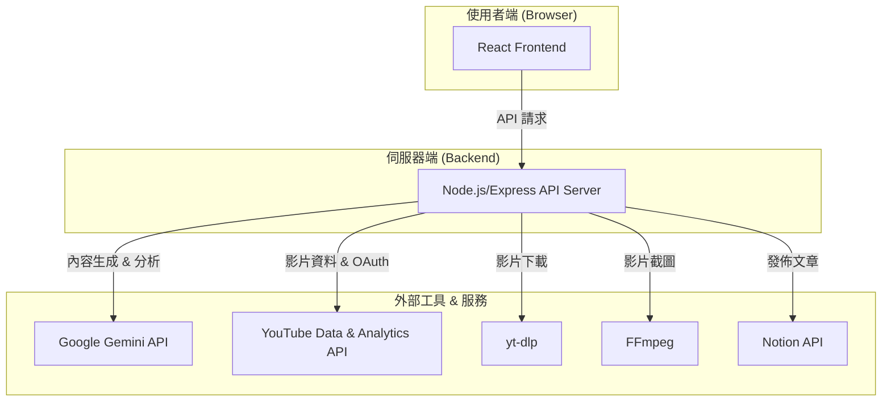

# AI Video Writer

[](https://opensource.org/licenses/MIT)
[](https://nodejs.org/)
[](https://reactjs.org/)
[](https://www.typescriptlang.org/)

**AI Video Writer 是一個智慧內容轉換工具，利用 Google Gemini 模型將 YouTube 影片自動轉換為 SEO 優化的文章、中繼資料和數據洞察。**

專為內容創作者、行銷人員和部落客設計，旨在簡化內容再利用的工作流程，並從現有影片中發掘最大價值。

---

## 核心功能

-   **📝 SEO 中繼資料生成**：一鍵生成三種不同風格的影片標題、結構化說明（含時間戳）和關鍵字標籤。
-   **✍️ 圖文文章生成**：將影片內容轉換為專業文章，並透過 AI 自動識別關鍵畫面進行截圖，實現真正的圖文並茂。
-   **📊 影片表現分析**：整合 YouTube Analytics API，提供數據驅動的儀表板，透過 AI 分析影片表現並提供具體改善建議。
-   **📂 多模態分析**：支援上傳參考檔案（圖片、PDF、Markdown 等），為 AI 提供更豐富的上下文，生成更深入、更客製化的內容。
-   **🚀 一鍵發佈至 Notion**：將生成的文章和截圖直接發佈到指定的 Notion 資料庫，簡化內容管理流程。
-   **🐳 Docker 支援**：提供完整的 Docker 環境，包含所有依賴項（Node.js, FFmpeg, yt-dlp），實現一鍵啟動。

## 系統架構

本專案採用前後端分離架構，確保了安全性與可擴展性。



-   **前端 (React + Vite)**：處理使用者介面、Google OAuth 認證和與後端 API 的通訊。
-   **後端 (Node.js + Express)**：作為應用程式的大腦，負責處理所有核心邏輯，包括與外部 API 的互動、執行 `yt-dlp` 和 `FFmpeg` 命令、管理非同步任務以及處理文件。
-   **API 金鑰安全**：所有敏感的 API 金鑰（如 `GEMINI_API_KEY`）都安全地儲存在後端，絕不外洩至前端。

---

## 快速入門

我們強烈建議使用 Docker 進行部署，這是最簡單、最快速的方式。

### 透過 Docker 部署 (建議)

1.  **複製專案**：
    ```bash
    git clone https://github.com/jaschiang/ai-video-writer.git
    cd ai-video-writer
    ```

2.  **設定環境變數**：
    複製 `.env.example` 並命名為 `.env.local`，然後填入您的金鑰。
    ```bash
    cp .env.example .env.local
    ```
    編輯 `.env.local` 檔案：
    ```env
    # 必要金鑰
    GEMINI_API_KEY="YOUR_GEMINI_API_KEY"
    YOUTUBE_CLIENT_ID="YOUR_YOUTUBE_CLIENT_ID.apps.googleusercontent.com"

    # 前端 URL (Docker 部署時通常不需更改)
    FRONTEND_URL="http://localhost:3000"
    ```
    > 關於如何取得金鑰，請參考 [Google API 設定](#google-api-設定) 章節。

3.  **啟動容器**：
    執行啟動腳本，它會自動讀取 `.env.local` 並啟動 Docker Compose。
    ```bash
    ./docker-start.sh
    ```
    或者，您也可以手動執行：
    ```bash
    docker compose up --build -d
    ```

4.  **開始使用**：
    開啟瀏覽器，造訪 `http://localhost:3001`。後端服務運行在 3001 埠，並代理前端應用。

    <details>
    <summary>Docker Desktop GUI 操作與疑難排解</summary>

    ### 介面操作 (GUI)

    如果您偏好使用 Docker Desktop 的圖形介面：

    1.  **建立容器**：
        -   **Port**: `3001:3001`
        -   **Env**: 填入 `GEMINI_API_KEY`、`YOUTUBE_CLIENT_ID` 等環境變數。
        -   **Volumes**: 設定持久化儲存，例如 `./temp_videos:/app/temp_videos`, `./public/images:/app/public/images`。
    2.  **啟動**：啟動容器後，瀏覽 `http://localhost:3001`。

    ### 疑難排解

    <details>
    <summary>常見問題與除錯步驟</summary>

    #### 常見問題

    | 問題 | 原因 | 解決方法 |
    | :--- | :--- | :------- |
    | `YouTube Client ID is not configured` | 環境變數未載入 | 確認 `.env.local` 存在且內容正確 |
    | `GEMINI_API_KEY is not set` | API Key 未設定 | 在 `.env.local` 中設定有效的 API Key |
    | `ffmpeg: command not found` | ffmpeg 未安裝 | 重新建置 image：`docker compose build --no-cache` |
    | `Container unhealthy` | 服務未正常啟動 | 查看日誌：`docker compose logs -f` |
    | `Port 3001 already in use` | 埠號被佔用 | 修改 `docker-compose.yml` 中的 port 或關閉佔用的程式 |
    | `Cannot connect to Docker daemon` | Docker Desktop 未啟動 | 啟動 Docker Desktop |

    #### 除錯步驟

    ```bash
    # 1. 查看容器狀態
    docker compose ps

    # 2. 查看詳細日誌
    docker compose logs -f ai-video-writer

    # 3. 進入容器檢查
    docker compose exec ai-video-writer /bin/bash

    # 4. 檢查環境變數 (在容器內)
    echo $GEMINI_API_KEY
    echo $YOUTUBE_CLIENT_ID

    # 5. 測試 ffmpeg 和 yt-dlp (在容器內)
    ffmpeg -version
    yt-dlp --version

    # 6. 重新建置 (如果問題持續)
    docker compose down
    docker compose build --no-cache
    docker compose up -d
    ```
    </details>

    ### 安全性注意事項

    請務必參考專案的 [安全性](#安全性) 章節，並遵循以下 Docker 部署的額外建議：
    -   **不要將 `.env.local` 提交到 Git**：已加入 `.gitignore`，包含敏感的 API Keys。
    -   **限制 API Key 使用**：在 Google Cloud Console 設定使用限制。
    -   **生產環境部署**：使用平台環境變數，啟用 HTTPS，設定 CORS 為實際網址。

    </details>

    ### 本機開發設定 (進階)
如果您不想使用 Docker，可以手動設定本機開發環境。

<details>
<summary>點此展開本機開發設定指南</summary>

#### 1. 安裝依賴工具

您需要安裝 Node.js, yt-dlp, 和 FFmpeg。

-   **Node.js** (v18 或更高版本)
    -   前往 [nodejs.org](https://nodejs.org/) 下載並安裝。

-   **yt-dlp** & **FFmpeg**
    -   **Windows (使用 [Winget](https://winstall.app/))**:
        ```powershell
        winget install yt-dlp
        winget install FFmpeg
        ```
    -   **macOS (使用 [Homebrew](https://brew.sh/))**:
        ```bash
        brew install yt-dlp
        brew install ffmpeg
        ```

#### 2. 安裝專案依賴

```bash
git clone https://github.com/jaschiang/ai-video-writer.git
cd ai-video-writer
npm install
```

#### 3. 設定環境變數

與 Docker 設定相同，建立 `.env.local` 檔案並填入您的金鑰。

#### 4. 啟動應用

使用以下指令同時啟動前端開發伺服器 (port 3000) 和後端伺服器 (port 3001)。

```bash
npm run dev:all
```

開啟瀏覽器，造訪 `http://localhost:3000`。

</details>

---

## Google API 設定

要使用此應用，您需要從 Google Cloud Console 取得 API 憑證。

<details>
<summary>點此展開 Google API 設定詳細步驟</summary>

1.  **建立 Google Cloud 專案**
    -   前往 [Google Cloud Console](https://console.cloud.google.com/) 並建立一個新專案。

2.  **啟用 APIs**
    -   在「程式庫」頁面，搜尋並啟用以下三個 APIs：
        -   `YouTube Data API v3`
        -   `YouTube Analytics API`
        -   `Generative Language API` (Gemini)

3.  **設定 OAuth 同意畫面**
    -   前往「OAuth 同意畫面」。
    -   使用者類型選擇「外部」。
    -   填寫應用程式名稱、使用者支援電子郵件等資訊。
    -   **新增範圍**：
        -   `https://www.googleapis.com/auth/youtube`
        -   `https://www.googleapis.com/auth/yt-analytics.readonly`
    -   **新增測試使用者**：加入您的 Google 帳號，以便在開發模式下登入。

4.  **建立 OAuth 2.0 用戶端 ID**
    -   前往「憑證」頁面，點選「建立憑證」 > 「OAuth 2.0 用戶端 ID」。
    -   應用程式類型選擇「網頁應用程式」。
    -   **已授權的 JavaScript 來源**：新增 `http://localhost:3000` 和 `http://localhost:3001`。
    -   **已授權的重新導向 URI**：新增 `http://localhost:3000` 和 `http://localhost:3001`。
    -   建立後，複製**用戶端 ID** 並填入 `.env.local` 的 `YOUTUBE_CLIENT_ID`。

5.  **建立 Gemini API 金鑰**
    -   前往「憑證」頁面，點選「建立憑證」 > 「API 金鑰」。
    -   建立後，複製**API 金鑰**並填入 `.env.local` 的 `GEMINI_API_KEY`。
    -   **（建議）** 為了安全，限制此金鑰只能存取 `Generative Language API`。

</details>

## 使用教學

1.  **登入**：開啟應用程式後，點選「Sign in with Google」並授權存取您的 YouTube 帳號。
2.  **選擇影片**：從列表中選擇您想處理的影片。您可以使用篩選器顯示未公開或私人影片。
3.  **生成中繼資料**：點選「生成中繼資料」，AI 將提供 SEO 優化的標題、說明和標籤。您可以直接編輯並一鍵更新到 YouTube。
4.  **生成文章**：點選「生成文章」。您可以選擇上傳參考檔案以提供更多上下文。AI 生成文章後，您可以選擇進一步「生成截圖」，將文章轉換為圖文並茂的格式。
5.  **分析影片表現**：切換到「影片分析」標籤頁，選擇時間範圍後開始分析。系統會對您的影片進行評分和排序，並提供 AI 驅動的改善建議。

## 客製化與調整

您可以輕鬆調整 AI 的行為或應用程式的設定。

-   **AI 提示詞 (Prompts)**：
    -   SEO 中繼資料：`services/promptService.js`
    -   文章生成：`services/articlePromptService.js`
    -   關鍵字分析：`services/keywordAnalysisPromptService.js`
    -   您可以修改其中的角色定義、輸出格式和風格指示，來客製化生成內容。
    > 更多關於提示詞設計的最佳實踐，請參考 [文件 > Gemini 提示詞設計最佳實踐](docs/GEMINI_PROMPT_BEST_PRACTICES.md)。

-   **影片下載與截圖品質**：
    -   在 `server.js` 中，您可以找到 `yt-dlp` 和 `ffmpeg` 的指令。透過修改參數（如 `-f` 或 `-q:v`），您可以調整下載影片的解析度或截圖的品質。

-   **Notion 整合**：
    -   在 `.env.local` 中設定 `NOTION_API_TOKEN` 和 `NOTION_DATABASE_ID` 可設定預設的發佈目標。
    -   應用程式也支援透過 OAuth 登入 Notion，讓使用者能動態選擇要發佈的資料庫。

## 安全性

本專案高度重視安全性。所有敏感的 API 金鑰都安全地儲存在後端，絕不會暴露給前端。所有使用者輸入都經過嚴格驗證，以防止常見的 Web 攻擊。

> 更多詳細資訊，請參考 [文件 > 專案安全政策與最佳實踐](docs/SECURITY.md) 和 [文件 > 安全性測試指南](docs/SECURITY_TESTING.md)。

## 專案指令

| 指令 | 描述 |
| :--- | :--- |
| `npm install` | 安裝所有依賴套件。 |
| `npm run dev` | 僅啟動前端開發伺服器 (Vite)。 |
| `npm run server` | 僅啟動後端伺服器 (Node.js)。 |
| `npm run dev:all` | **(推薦)** 同時啟動前後端。 |
| `npm run build` | 建置用於生產環境的前端應用。 |
| `npm run preview` | 預覽建置後的應用。 |

## 授權

本專案採用 [MIT 授權](LICENSE)。

---

**免責聲明**: 本工具旨在輔助內容創作，使用者應對其發布的內容負最終責任。請遵守 YouTube 和 Google 的服務條款。

*由 [Jas Chiang](https://www.linkedin.com/in/jascty/) 創建，並由 Claude Code、Codex 和 Gemini CLI 協助開發。*
