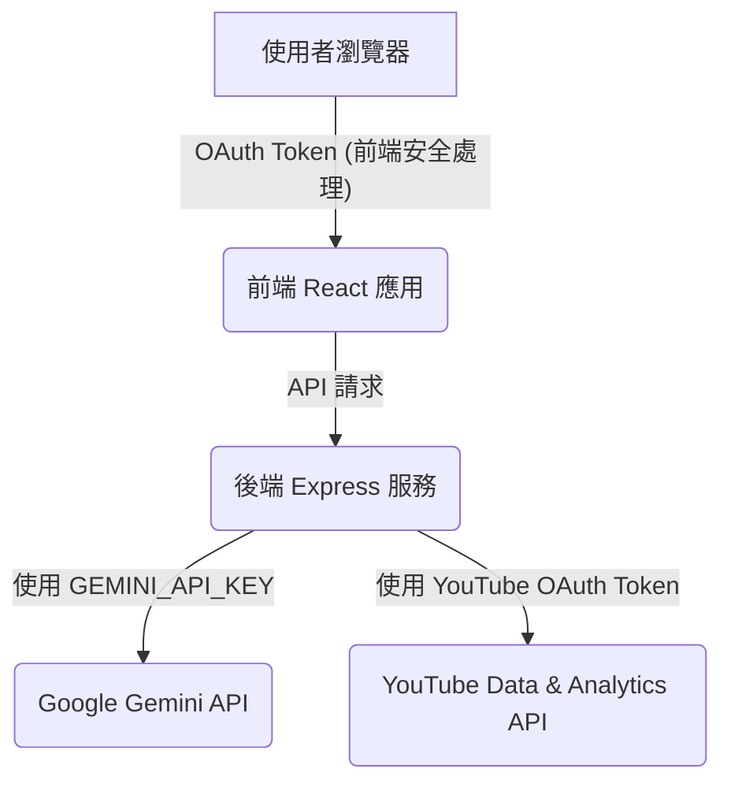

# 🔒 AI Video Writer 專案安全政策與最佳實踐

> **最後更新**: 2025-01-05
>
> 本文件詳細說明 AI Video Writer 專案的資安政策、開發與部署的最佳實踐，以及如何識別、緩解和回報潛在的安全風險。

---

## 📋 目錄

-   [安全概覽](#安全概覽)
-   [核心安全原則](#核心安全原則)
-   [環境變數安全](#環境變數安全)
-   [程式碼管理安全 (Git & GitHub)](#程式碼管理安全-git--github)
-   [Docker 部署安全](#docker-部署安全)
-   [應用程式運行時安全](#應用程式運行時安全)
-   [生產環境部署建議](#生產環境部署建議)
-   [回報安全問題](#回報安全問題)
-   [參考資源](#參考資源)

---

## 安全概覽

AI Video Writer 是一個利用 Google Gemini 和 YouTube API 的內容生成工具。其安全策略旨在保護用戶數據、API 憑證和應用程式的完整性。

### 資料流向與敏感資訊隔離



-   **API Key 隔離**：所有敏感的 API Key (如 `GEMINI_API_KEY`) 僅存在於後端服務器，絕不暴露給前端。
-   **OAuth Token**：YouTube OAuth Token 在前端安全處理，並透過後端進行 API 呼叫。

---

## 核心安全原則

1.  **🔐 最小權限原則 (Principle of Least Privilege)**：只請求應用程式運作所需的最低 API 權限。
2.  **🚫 不信任任何輸入 (Never Trust User Input)**：所有來自用戶的輸入都必須經過嚴格的驗證和清理。
3.  **🛡️ 深度防禦 (Defense in Depth)**：在應用程式的各個層面實施多重安全控制。
4.  **🔄 定期更新與審查**：定期更新依賴項，並審查程式碼和安全配置。
5.  **🗑️ 敏感資訊隔離**：敏感憑證和數據必須妥善儲存，絕不硬編碼或提交到版本控制。

---

## 環境變數安全

### 最佳實踐

-   **開發環境**：使用 `.env.local` 檔案儲存環境變數。此檔案必須加入 `.gitignore`，確保不會被提交到版本控制。
-   **生產環境**：使用部署平台提供的環境變數管理功能（例如 Render, Vercel, AWS 等），絕不將 `.env` 檔案部署到生產環境。

### 檢查環境變數是否安全

-   **前端建置結果檢查**：
    ```bash
    npm run build
    grep -r "AIzaSy" dist/  # 應找不到任何 Gemini API Key 模式
    grep -r "GEMINI_API_KEY" dist/  # 應找不到任何結果
    ```
-   **Git 歷史記錄檢查**：
    ```bash
    git log --all --full-history -- .env.local  # 檢查是否曾提交 .env.local
    git log -p | grep -E "AIzaSy|secret_"       # 檢查歷史記錄中是否有 API Key 或 Secret
    ```
    如果發現問題，請參考 [清理 Git 歷史](#清理-git-歷史) 章節。

---

## 程式碼管理安全 (Git & GitHub)

### GitHub 上傳前檢查清單

在將程式碼推送到 GitHub 之前，請務必執行以下檢查：

1.  **`.gitignore` 配置**：確認 `.gitignore` 檔案包含所有敏感檔案和目錄（如 `.env.local`, `temp_videos/`, `node_modules/` 等）。
2.  **敏感檔案追蹤**：執行 `git status` 檢查是否有敏感檔案被意外追蹤。
3.  **程式碼掃描**：在專案目錄中執行 `grep -r "AIzaSy[a-zA-Z0-9_-]{33}" . --exclude-dir=node_modules --exclude-dir=dist` 檢查程式碼中是否硬編碼了 Gemini API Key。

### 清理 Git 歷史

如果不小心將敏感資訊提交到 Git 歷史記錄中，請**立即**採取以下措施：

1.  **撤銷憑證**：立即撤銷所有已洩漏的 API Key 或 Secret。
2.  **清理歷史記錄**：使用 `git filter-branch` 或 [BFG Repo-Cleaner](https://rtyley.github.io/bfg-repo-cleaner/) 等工具從 Git 歷史中徹底移除敏感資訊。
    > **警告**：清理 Git 歷史會改寫提交記錄，需要 `force push`，並通知所有協作者重新 clone 專案。
3.  **更新憑證**：生成新的 API Key 或 Secret，並更新應用程式配置。

### GitHub Secret Scanning

GitHub 會自動掃描公共儲存庫中的 API Key。如果偵測到您的憑證，您將收到通知。請務必立即撤銷並更換受影響的憑證。

---

## Docker 部署安全

### Dockerfile 最佳實踐

-   **使用官方基礎映像**：從官方或受信任的基礎映像開始 (例如 `node:20-slim`)。
-   **最小化映像大小**：只安裝應用程式運行所需的必要套件。
-   **使用非 Root 用戶**：在 Dockerfile 中創建並使用非 root 用戶運行應用程式 (`USER appuser`)，以限制潛在的損害。
-   **不要複製敏感檔案**：確保 `.env` 檔案或任何敏感配置不會被複製到 Docker Image 中。
-   **環境變數注入**：敏感環境變數應在容器運行時注入，而非在建置時硬編碼。

### `.dockerignore` 配置

確認 `.dockerignore` 檔案包含所有不應包含在 Docker Image 中的檔案和目錄，例如：
-   `.env`, `.env.local`
-   `node_modules/`
-   `temp_videos/`, `temp_files/`, `public/images/`
-   `.git/`

### Docker Image 安全掃描

建議使用工具（如 Trivy, Snyk, Docker Scan）定期掃描 Docker Image，以識別潛在的漏洞。

---

## 應用程式運行時安全

### 1. 輸入驗證

-   **原則**：所有來自用戶的輸入都必須經過嚴格的驗證和清理。
-   **實施**：
    -   **`videoId` 驗證**：對 YouTube `videoId` 進行嚴格的正規表達式驗證 (`/^[a-zA-Z0-9_-]{11}$/`)。
    -   **危險字元阻擋**：阻擋潛在的 Command Injection 字元（如 `;`, `|`, `&`, `$`, `` ` ``, `(`, `)` 等）。
-   **測試**：請參考 [安全性測試指南](./SECURITY_TESTING.md) 進行詳細的輸入驗證測試。

### 2. CORS 配置

-   **原則**：限制跨域資源共享 (CORS) 僅允許來自授權前端的請求。
-   **實施**：在 `server.js` 中配置 `cors` 中介軟體，明確指定 `origin` 為 `process.env.FRONTEND_URL` 或 `http://localhost:3000`。
-   **避免**：在生產環境中避免使用 `app.use(cors())` 允許所有來源。

### 3. 速率限制 (Rate Limiting)

-   **原則**：保護 API 免受濫用、DDoS 攻擊和配額耗盡。
-   **建議**：導入 `express-rate-limit` 等中介軟體，對所有 API 端點實施速率限制，特別是針對 Gemini API 相關的端點，應設定更嚴格的限制。
-   **參考**：請參考 [Gemini API 速率限制與配額管理](../gemini_api/RATE_LIMITS.md) 了解更多資訊。

### 4. 檔案上傳安全

-   **原則**：確保用戶上傳的檔案不會對系統造成危害。
-   **實施**：
    -   **檔案類型檢查**：限制上傳檔案的 MIME 類型為已知且安全的類型。
    -   **檔案大小限制**：設定合理的檔案大小上限。
    -   **隔離儲存**：將上傳的檔案儲存在獨立的暫存目錄 (`temp_files/`)。
    -   **自動清理**：上傳後或處理完成後自動刪除暫存檔案。
-   **建議**：在生產環境中，可考慮整合病毒掃描服務。

### 5. 日誌管理

-   **原則**：日誌應提供足夠的資訊用於除錯和監控，但絕不能洩漏敏感資訊。
-   **建議**：
    -   **使用專業日誌庫**：導入 `winston` 或 `pino` 等專業日誌庫，實現日誌級別控制、格式化、輪轉和安全過濾。
    -   **環境變數控制**：僅在開發環境輸出詳細日誌，生產環境應限制日誌詳細程度。
    -   **避免記錄敏感資訊**：絕不在日誌中記錄 API Keys、Tokens、密碼等敏感數據。

### 6. 錯誤處理

-   **原則**：錯誤訊息應對用戶友好，且不能洩漏系統內部細節。
-   **建議**：
    -   在生產環境中，對用戶顯示通用的錯誤訊息（例如「處理請求時發生錯誤，請稍後再試」）。
    -   詳細的錯誤堆疊追蹤和系統資訊應僅記錄在後端日誌中。
    -   使用統一的錯誤處理中介軟體來集中管理錯誤回應。

---

## 生產環境部署建議

### 部署前檢查清單

-   [ ] **環境變數**：所有敏感環境變數都已設定在部署平台，且 `NODE_ENV` 設定為 `production`。
-   [ ] **HTTPS**：啟用 HTTPS (必須)。
-   [ ] **CORS**：CORS `origin` 設定為實際的前端網址。
-   [ ] **API Key 限制**：在 Google Cloud Console 中為 API Key 設定 HTTP referrer 或 IP 位址限制，並僅允許必要的 API。
-   [ ] **OAuth 憑證**：更新 OAuth Client ID 的授權網址為生產網址。
-   [ ] **監控**：設定錯誤監控、性能監控和 API 配額警示。
-   [ ] **日誌**：確認日誌配置為生產模式（不輸出敏感資訊，日誌級別適當）。

### 定期維護

-   **每月**：執行 `npm audit` 檢查依賴套件漏洞，更新依賴套件，掃描 Docker Image。
-   **每季**：更換 API Keys，審查 Google Cloud 的 API 使用情況和存取日誌。
-   **每年**：進行完整的安全審計，更新所有依賴到最新穩定版本，檢視並更新安全政策。

---

## 回報安全問題

如果您在 AI Video Writer 專案中發現任何安全漏洞，請**不要公開發布**。

### 回報方式

1.  **Email**：直接聯繫專案維護者 (請參考 `README.md` 中的聯繫方式)。
2.  **GitHub Security Advisory**：透過 GitHub 的安全諮詢功能回報 (前往 repository → Security → Report a vulnerability)。

### 請提供以下資訊

-   漏洞的詳細描述。
-   重現漏洞的步驟。
-   漏洞的潛在影響範圍。
-   建議的修復方案 (如有)。

### 回應時程

-   **24 小時內**：確認收到回報。
-   **7 天內**：評估漏洞嚴重程度並制定修復計畫。
-   **30 天內**：發布修復 (時程可能根據漏洞嚴重程度調整)。

---

## 📚 相關文件

-   [安全性測試指南](./SECURITY_TESTING.md)
-   [AI Video Writer 專案安全審計報告](./SECURITY_REPORT.md)
-   [專案改進與發展藍圖](./IMPROVEMENTS.md)
-   [Google Gemini 官方安全指南](https://ai.google.dev/gemini-api/docs/safety-guidance)

---

<div align="center">

**🔒 安全是每個人的責任**

</div>