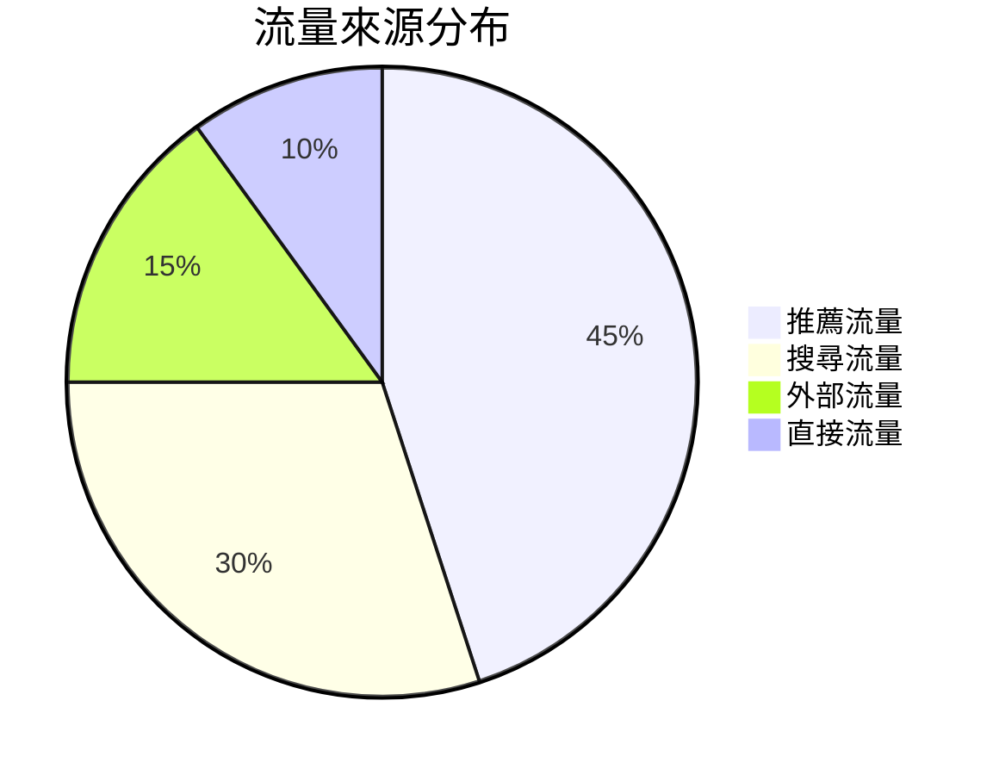
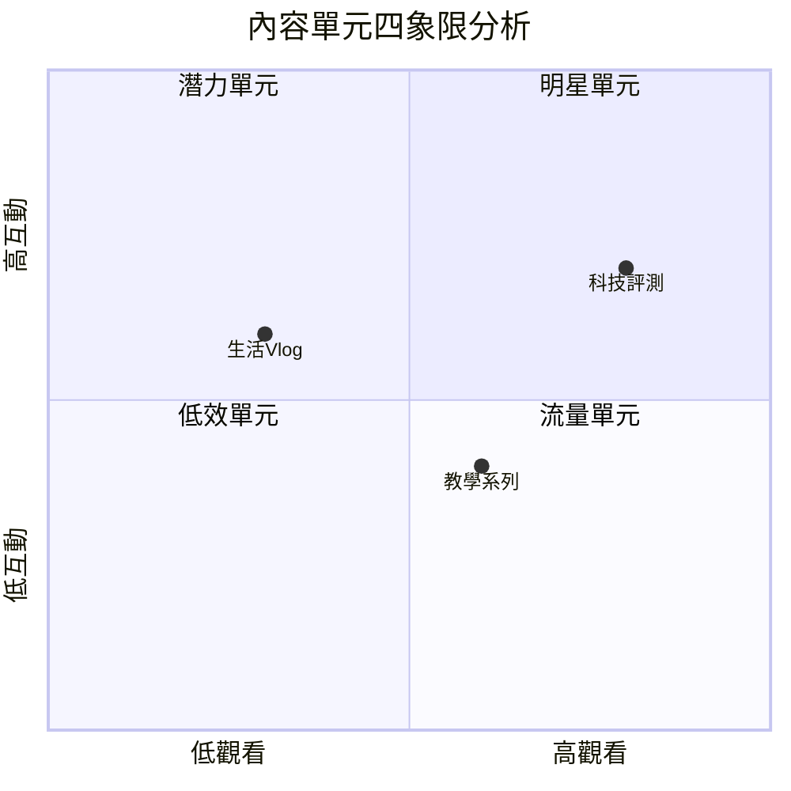
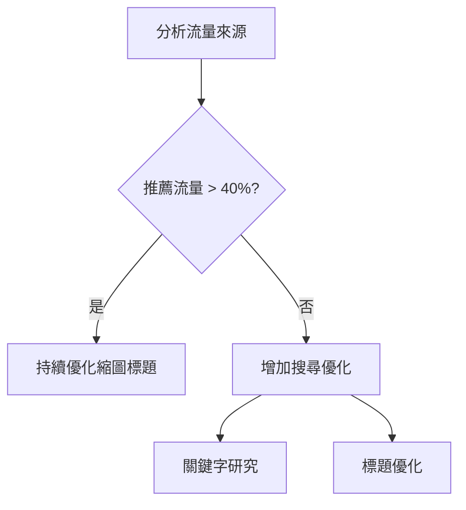
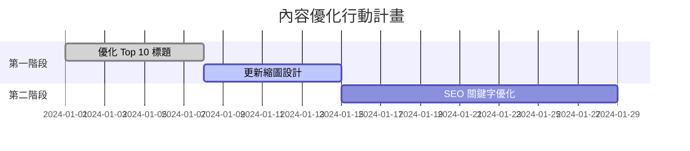

# Mermaid 圖表語法參考

本專案的 AI 分析報告支援 **Mermaid 圖表**，但**並非所有圖表類型都支援**。

## ✅ 支援的圖表類型

### 1. 餅圖 (Pie Chart)

**使用場景**：流量來源分布、觀眾年齡分布

**語法範例**：
````markdown

````

**渲染效果**：圓餅圖，顯示各部分占比

---

### 2. 四象限圖 (Quadrant Chart)

**使用場景**：內容單元分類、影片效能象限

**語法範例**：
````markdown

````

**渲染效果**：四個象限，每個點代表一個數據項目

---

### 3. 流程圖 (Flowchart)

**使用場景**：決策流程、優化步驟

**語法範例**：
````markdown

````

**渲染效果**：方框和箭頭組成的流程圖

---

### 4. 甘特圖 (Gantt Chart)

**使用場景**：行動計畫時間軸、內容排程

**語法範例**：
````markdown

````

**渲染效果**：橫向時間軸，顯示任務進度

---

## ❌ 不支援的圖表類型

### ❌ 雷達圖 (Radar Chart)

**錯誤語法**：
```
chart
  type: radar
  title: 頻道健康度雷達圖
  labels: ["內容效率","觀眾留存","流量結構","增長勢能"]
  series:
    - title: "目前狀態"
      data: [25, 30, 40, 35]
```

**錯誤訊息**：
```
UnknownDiagramError: No diagram type detected matching given configuration
```

**替代方案**：使用 **Markdown 表格**

| 健康指標 | 評分 | 狀態 |
|---------|------|------|
| 內容效率 | 25/100 | 需改進 |
| 觀眾留存 | 30/100 | 需改進 |
| 流量結構 | 40/100 | 良好 |
| 增長勢能 | 35/100 | 良好 |

---

### ❌ 折線圖 (Line Chart)

**不支援原因**：Mermaid 沒有原生折線圖語法

**替代方案**：
1. 使用 **ASCII 文字圖表**
2. 使用 **Markdown 表格**呈現趨勢數據

---

### ❌ 柱狀圖 (Bar Chart)

**不支援原因**：Mermaid 的 bar chart 語法較新且不穩定

**替代方案**：使用 **Markdown 表格** + **文字說明**

---

## 📋 最佳實踐建議

### 1. **優先使用 Markdown 表格**
- ✅ 相容性最佳（所有環境都支援）
- ✅ 清晰易讀
- ✅ 不會渲染錯誤
- ✅ 易於複製貼上數據

### 2. **謹慎使用 Mermaid 圖表**
- ✅ 僅用於視覺化效果明顯優於表格的場景
- ✅ 使用前測試語法是否正確
- ✅ 提供備用的表格版本

### 3. **圖表語法規範**
- 必須使用 ` ```mermaid ` 開頭
- 必須正確縮排
- 必須使用支援的圖表類型

---

## 🔧 如何修復圖表錯誤

### 步驟 1：識別錯誤類型
查看錯誤訊息中的 `type: xxx`，檢查是否為不支援的類型

### 步驟 2：選擇替代方案
- 如果是雷達圖 → 改用表格
- 如果是折線圖 → 改用 ASCII 文字圖或表格
- 如果是柱狀圖 → 改用表格

### 步驟 3：更新提示詞
在 `services/analysisPrompts/PromptTemplates.js` 中明確禁止不支援的圖表類型

---

## 📚 Mermaid 官方文件

- [Mermaid 官方網站](https://mermaid.js.org/)
- [Pie Chart 文檔](https://mermaid.js.org/syntax/pie.html)
- [Quadrant Chart 文檔](https://mermaid.js.org/syntax/quadrantChart.html)
- [Flowchart 文檔](https://mermaid.js.org/syntax/flowchart.html)
- [Gantt 文檔](https://mermaid.js.org/syntax/gantt.html)

---

## 🎯 總結

| 圖表類型 | 支援狀態 | 使用場景 |
|---------|---------|---------|
| Pie Chart | ✅ 支援 | 占比分布 |
| Quadrant Chart | ✅ 支援 | 四象限分析 |
| Flowchart | ✅ 支援 | 流程決策 |
| Gantt Chart | ✅ 支援 | 時間規劃 |
| Radar Chart | ❌ **不支援** | ~~健康度評分~~ → 改用表格 |
| Line Chart | ❌ **不支援** | ~~趨勢分析~~ → 改用表格 |
| Bar Chart | ❌ **不支援** | ~~數值對比~~ → 改用表格 |

**關鍵原則**：**表格優於圖表，清晰勝於華麗**
